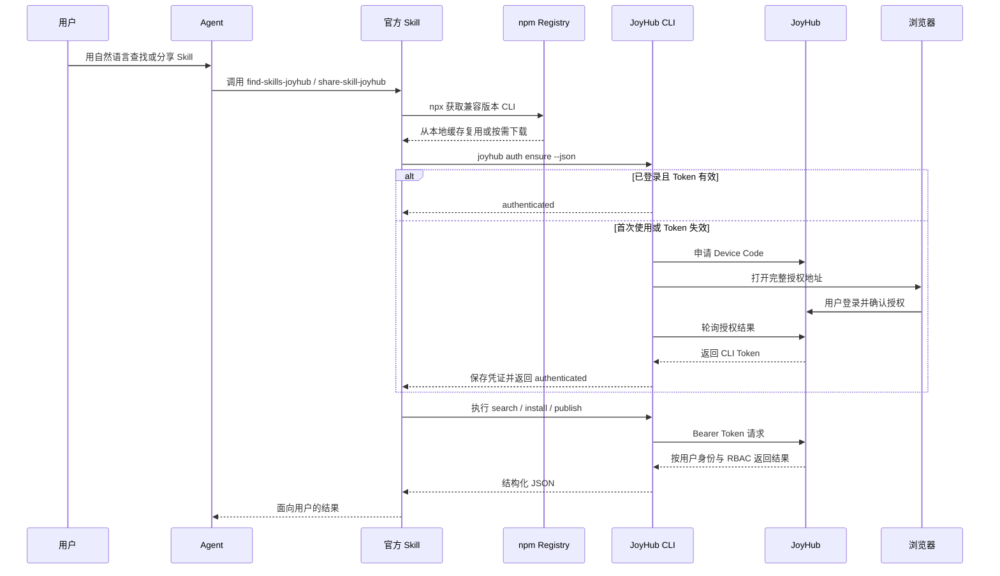

# JoyHub Agent `find-skills-joyhub` / `share-skill-joyhub` MVP Spec

> 状态：Draft（待评审）  
> 版本：v1.0  
> 日期：2026-08-19

## 1. 决策摘要

- 提供两个官方 Skill：`find-skills-joyhub` 和 `share-skill-joyhub`。
- MVP 仅支持 Codex、Claude Code 等本地 Agent 工具；Hermes 集成放入后续迭代。
- 两个 Skill 不直接访问 JoyHub API，统一通过 JoyHub 自有 CLI 执行认证、搜索、安装和发布。
- CLI 以公开 Scoped Package `@toolnets/joyhub-cli` 发布到 npm，bin 为 `joyhub`；Skill 使用
  固定兼容版本 `0.2.0` 的 `npx` 按需运行，不要求用户全局安装。
- 用户首次使用任一 Skill 时完成一次浏览器授权；后续两个 Skill 复用同一登录态。
- 搜索前必须登录，不区分公开和内部 Skill；服务端统一返回当前用户有权查看的全部 Skill。
- 本期复用现有 Device Flow，不新增独立 Agent Token 或 Agent Tool。
- 不使用原项目的 `@astron-team/skillhub` 包名；正式包名为 `@toolnets/joyhub-cli`。

## 2. 背景与目标

当前用户需要先理解 JoyHub 页面、CLI 命令和 Token 管理方式，才能在 Agent 中查找或分享
Skill；同时 CLI 与服务端能力存在不同步风险。

MVP 目标是让用户在 Agent 中直接使用自然语言：

- “帮我找一个分析广告投放数据的 Skill。”
- “把当前目录的 Skill 分享到数据团队。”

首次使用时，`npx` 自动获取 CLI 并完成一次 JoyHub 绑定；后续无需安装全局命令、再次登录或
手工处理 Token。

## 3. 范围

### 3.1 本期包含

- Codex、Claude Code 等能够执行本地命令的 Agent。
- `find-skills-joyhub`：自然语言搜索、结果推荐、用户选择后安装。
- `share-skill-joyhub`：本地校验、dry-run、选择 Namespace、用户确认后发布。
- CLI 首次浏览器授权、登录态检查、凭证复用和失效重登。
- CLI 与当前 JoyHub 搜索、安装、发布及 Namespace RBAC 能力同步。
- JoyHub 自有 npm 包的命名、构建、公开发布及版本兼容策略。
- CLI/API 契约和端到端回归检查。

### 3.2 本期不包含

- Hermes、飞书身份透传及服务端自动绑定。
- 匿名搜索或公开/内部 Skill 的双轨搜索体验。
- 独立于 CLI 的 MCP Server、Agent Tool 或 SDK。
- Token 的 Namespace 级细粒度 Scope。
- macOS Keychain、Windows Credential Manager 等系统凭证库适配。
- npm 之外的独立二进制、安装脚本或私有 Registry 分发。
- 自动发布；发布前必须由用户确认目标 Namespace 和版本信息。

### 3.3 前置条件与待定项

- 本地环境需要 Node.js 和 npm，并能够访问配置的 npm Registry。
- npm 包固定为 `@toolnets/joyhub-cli`，二进制命令固定为 `joyhub`。
- 首次发布前必须确认团队拥有 `@joycastle` npm Scope；不得使用原项目的 `@astron-team` Scope。
- 官方 Skill 固定使用经过联调的 CLI `0.2.0`，不直接使用无约束的 `latest`。

## 4. 总体流程



## 5. 功能需求

### 5.1 首次绑定与登录态

两个 Skill 每次执行前都调用：

```bash
npx --yes \
  --package=@toolnets/joyhub-cli@0.2.0 \
  joyhub auth ensure --registry https://joyhub.toolnets.net --json
```

CLI 行为：

1. `npx` 优先复用 npm 缓存；本地没有兼容版本时按需下载，不执行全局安装。
2. CLI 根据当前 Registry 读取本地凭证，并调用 `whoami` 验证。
3. Token 有效时返回 `authenticated`，不打开浏览器。
4. Token 缺失、过期或被撤销时发起 Device Flow。
5. 本地桌面环境自动打开完整授权地址，用户在 JoyHub 完成登录和一次确认。
6. 无法打开浏览器时输出可点击授权地址和一次性验证码，作为降级方式。
7. 授权成功后由 CLI 保存 Token，并继续原始查找或分享任务。
8. 授权超时或被拒绝时返回结构化错误，不执行后续命令。

首次授权一次性申请 `skill:read` 和 `skill:publish`。实际可见范围和可发布 Namespace 仍由
JoyHub 用户身份、平台角色和 Namespace RBAC 决定。

### 5.2 `find-skills-joyhub`

流程：

1. 从用户自然语言中提取用途、关键词和约束条件。
2. 通过 `npx` 获取兼容版本 CLI 并确保用户已登录。
3. 调用 CLI 搜索，并获取当前用户有权查看的全部候选。
4. Agent 根据相关性解释并推荐结果，至少展示坐标、简介、版本和 Namespace。
5. 用户明确选择后，调用 CLI 安装到当前 Agent 对应的 Skill 目录。
6. 返回安装位置和下一步使用说明。

命令契约：

```bash
npx --yes --package=@toolnets/joyhub-cli@0.2.0 \
  joyhub search --query "<query>" --limit <n> \
    --registry https://joyhub.toolnets.net --json
npx --yes --package=@toolnets/joyhub-cli@0.2.0 \
  joyhub install "@<namespace>/<skill>" --dir "<target>" \
    --registry https://joyhub.toolnets.net --json
```

要求：

- 搜索 API 必须在服务端按当前用户身份过滤，Skill 和 Agent 不自行拼接权限条件。
- 搜索请求未认证时返回 `401`，CLI 自动进入一次绑定流程。
- 安装前需要用户选择具体 Skill；不得仅根据模糊搜索结果自动安装。

### 5.3 `share-skill-joyhub`

流程：

1. 定位本地 Skill 根目录，检查 `SKILL.md` 和包结构。
2. 通过 `npx` 获取兼容版本 CLI 并确保用户已登录。
3. 获取用户可发布的 Namespace；只有一个时可默认选中，多个时由用户选择。
4. 执行 dry-run，返回版本、文件清单、目标 Namespace 和校验结果。
5. 用户确认后执行正式发布。
6. 返回 `@{namespace}/{skill}`、版本及 `PUBLISHED`、`PENDING_REVIEW` 等实际状态。

命令契约：

```bash
npx --yes --package=@toolnets/joyhub-cli@0.2.0 \
  joyhub publish "<directory>" --namespace "<slug>" \
    --visibility "<visibility>" --dry-run \
    --registry https://joyhub.toolnets.net --json
npx --yes --package=@toolnets/joyhub-cli@0.2.0 \
  joyhub publish "<directory>" --namespace "<slug>" \
    --visibility "<visibility>" \
    --registry https://joyhub.toolnets.net --json
```

要求：

- 服务端按 Namespace `OWNER`、`ADMIN`、`MEMBER` 角色和 Namespace 状态校验发布权限。
- `FROZEN` 或 `ARCHIVED` Namespace 不允许发布。
- Skill 使用 `@{namespace_slug}/{skill_slug}` 坐标，不使用客户端自定义映射。
- dry-run 和正式发布必须显式传入同一可见性；用户未指定时默认 `public`。
- 未经用户确认，不执行正式发布。

## 6. Token 存储与安全

MVP 使用 JoyHub 自有凭证目录：

```text
~/.joyhub/credentials.json
```

- Token 按 Registry URL 隔离存储，文件权限必须为 `0600`。
- Token 只由 CLI 读取和写入；Skill 不解析凭证文件。
- Token 不得出现在 CLI 标准输出、Agent 上下文、日志、命令参数或错误信息中。
- Device Code 和 User Code 为短期一次性数据，服务端继续存放在 Redis 并按现有 TTL 失效。
- `logout` 删除对应 Registry 的本地 Token；服务端 Token 撤销后，下次执行自动触发重新绑定。

系统凭证库适配作为后续安全增强，不阻塞 MVP。

## 7. CLI 发布与 API 同步要求

- CLI 作为两个官方 Skill 的唯一执行入口，必须覆盖认证、搜索、安装和发布完整流程。
- Device Flow 服务端能力已存在，本期重点是将 CLI 的 `login/auth ensure` 接入该流程。
- CLI 所使用的 API 应形成稳定、版本化的契约；接口变化必须同步更新 CLI。
- CLI 以公开 Scoped Package 发布，包名为 `@toolnets/joyhub-cli`，bin 名为 `joyhub`。
- 首个版本通过 npm 账号和 2FA 完成公开发布；后续使用 npm Trusted Publishing 与 GitHub
  Actions OIDC 自动发布，不长期保存 npm 发布 Token。
- npm 发布前必须执行 lint、typecheck、test、build 和 `npm pack --dry-run`。
- 官方 Skill 声明兼容 CLI 版本；升级 CLI 主版本时必须同步验证并更新两个 Skill。
- 仓库内必须清理原项目包名、命令名、凭证目录、README 和发布流水线中的品牌引用。
- CI 至少覆盖以下链路：
  - Device Flow 登录成功、超时、拒绝、Token 撤销后重登。
  - 已认证搜索仅返回当前用户可见的 Skill。
  - 搜索、选择与安装。
  - dry-run、Namespace RBAC 校验与正式发布。
  - CLI/API 契约漂移检查。

## 8. 错误与降级

| 场景 | 预期行为 |
|---|---|
| Node.js 或 npm 不可用 | 停止任务并提示运行时要求，不回退为直接 HTTP |
| npm 包首次下载失败 | 返回 Registry、网络或包版本错误，并提供重试方式 |
| 浏览器无法打开 | 返回可点击授权地址和一次性验证码 |
| 用户取消或授权超时 | 停止任务并给出可重试命令 |
| Token 失效 | 清理无效登录态并重新发起一次绑定 |
| 搜索无结果 | 提示调整关键词，不回退为匿名搜索 |
| 无可发布 Namespace | 返回权限说明，不上传包 |
| Namespace 无权限或不可发布 | 返回服务端 `403` 或业务错误，不绕过 RBAC |
| CLI/API 版本不兼容 | 返回兼容版本要求，不静默改用 `latest` 或错误接口 |

## 9. 验收标准

- [ ] 具备 Node.js/npm 的全新环境无需全局安装 CLI 即可调用两个 Skill。
- [ ] 首次调用通过 `npx` 获取自有 npm 包，并自动打开 JoyHub 授权页。
- [ ] 公开 npm 包无需 npm 登录即可下载和执行。
- [ ] 用户完成一次授权后，原搜索任务自动继续，无需复制 Token。
- [ ] 随后调用 `share-skill-joyhub` 不再打开授权页。
- [ ] 搜索结果与同一用户在 JoyHub Web 端的可见范围一致。
- [ ] 用户选择 Skill 后，可安装到 Codex 或 Claude Code 对应目录。
- [ ] `share-skill-joyhub` 在正式发布前展示 dry-run 结果并等待用户确认。
- [ ] 无目标 Namespace 权限时发布失败，且不会产生 Skill 版本。
- [ ] Token 缺失、过期或被撤销时能重新绑定。
- [ ] CLI 和 Skill 的输出及日志中不包含 Token。
- [ ] 无图形界面时可以通过授权链接完成绑定。
- [ ] npm 包、bin、凭证目录和用户提示中不再出现原项目品牌标识。
- [ ] CI 能阻止服务端接口变化但 CLI 未同步的变更合入。

## 10. 后续迭代

- Hermes 复用飞书身份、身份绑定和无 CLI 鉴权。
- npm 之外的独立二进制或企业私有 Registry 分发。
- 系统 Keychain/Credential Manager 存储。
- Namespace 级 Token Scope 和最小权限授权。
- 更丰富的语义检索、推荐排序和团队使用信号。
- MCP/SDK 等非 CLI 接入方式。

## 11. 参考实现

- [SkillHub `find skill`](https://skillhub.cn/skills/user_290ac21c/find-skill-skillhub)
- [SkillHub CLI 安装说明](https://skillhub.cn/install/skillhub.md)
- [SkillHub 发布助手](https://skillhub.cn/skills/user_7db0c006/skillhub-cli-publish)
- [npm：创建和发布公开 Scoped Package](https://docs.npmjs.com/creating-and-publishing-scoped-public-packages/)
- [npm：Trusted Publishing](https://docs.npmjs.com/trusted-publishers/)
